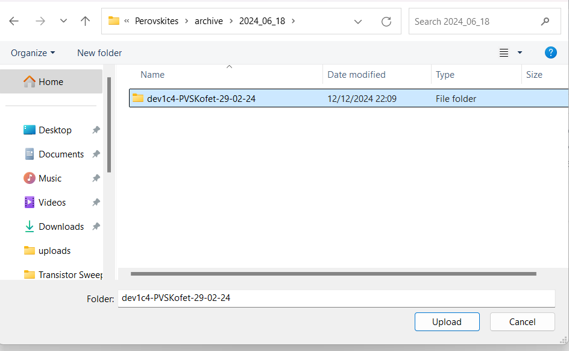
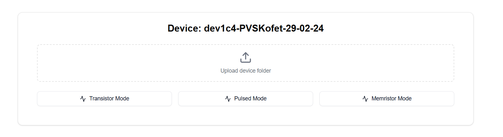
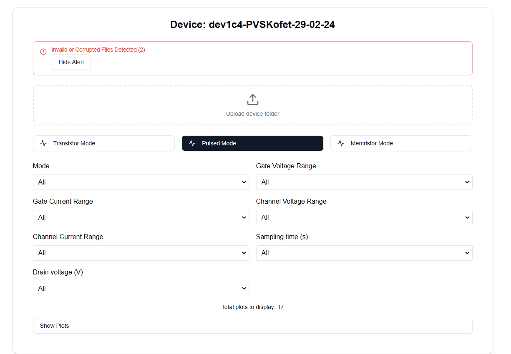
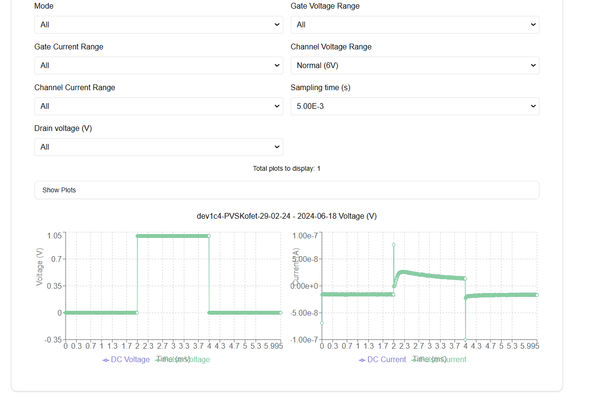

# Device Data Analyzer

A React-based web application for analyzing and visualizing electrical device measurement data.

add image here






## Features

- Support for multiple measurement modes (Memristor, Pulsed, Transistor)
- Real-time data visualization
- Automatic file validation and error detection
- Interactive plots with zoom and pan capabilities

## Prerequisites

- Node.js 16.x or later
- npm or yarn

## Installation

1. Clone the repository:
```bash
git clone https://github.com/andreas-geo/Perovskites.git
cd Perovskites/file-analyzer
```

2. Install dependencies:
```bash
npm install
# or
yarn install
```

3. Install required UI components:
```bash
npx shadcn-ui@latest init
npx shadcn-ui@latest add alert button card
```

## Running the Application

Start the development server:
```bash
npm run dev
# or
yarn dev
```

Navigate to `http://localhost:3000` in your browser.

## Usage

1. Click "Upload device folder" to select a folder containing measurement data.
2. Choose a measurement mode (Memristor, Pulsed, or Transistor).
 - The application will automatically detect the available measurement modes.
3. Select custom filter to apply for showing the plots.
 - The application will automatically detect the available filters.
4. View the generated plots and analysis

## File Structure Requirements

Data files should be organized in the following structure:
```
DeviceName/
├── Memristor/
│   └── *.txt
├── Pulsed/
│   └── *.txt
└── Transistor Sweep/
    └── *.txt
```

## Dependencies

- React 18
- Next.js 14
- Recharts
- shadcn/ui
- Lucide React
- Tailwind CSS
- Lodash

## License

MIT